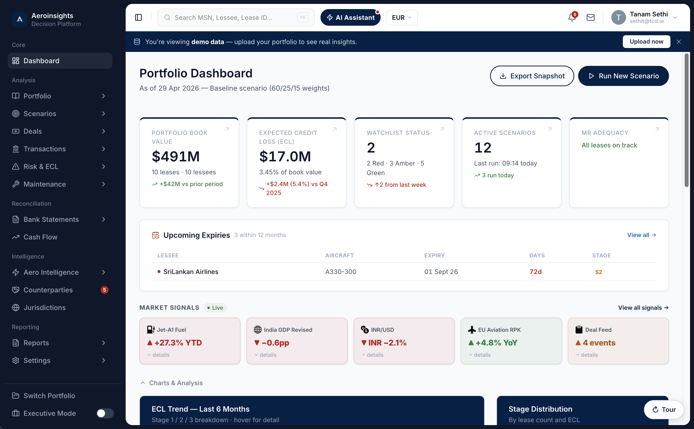
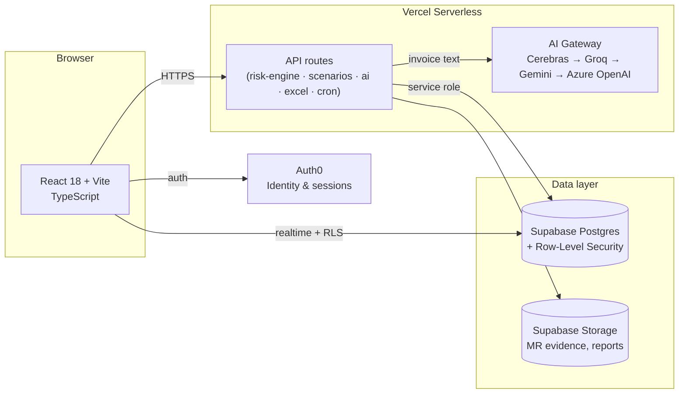

<div align="center">


# Aeroinsights

**The decision platform for aviation lessors — IFRS 9 ECL, maintenance reserves, and portfolio stress testing in one place.**

[](https://react.dev)
[](https://www.typescriptlang.org)
[](https://vitejs.dev)
[](https://supabase.com)
[](https://vercel.com)
[](https://auth0.com)
[](https://github.com/tanamsethi31/AeroInsights/actions/workflows/ci.yml)
[](https://aeroinsights.vercel.app)

<br />



</div>

<br />

## What it is

Aeroinsights turns the spreadsheets an aviation lessor's risk and portfolio teams already keep — lease terms, maintenance reserve schedules, servicer reports, macro assumptions — into a live analytics platform. Upload a portfolio, and it computes IFRS 9 expected credit loss, tracks maintenance reserve adequacy per component, runs multi-scenario stress tests, and reconciles cash against bank statements, all without leaving the browser.

It's built for the workflow a lessor actually has: real MRO invoices get uploaded and AI-extracted into component costs, not typed in from memory; every override carries an audit trail; and every number in a report traces back to the assumption that produced it.

## Core capabilities

| | |
|---|---|
| 🧮 **IFRS 9 ECL Engine** | Stage migration, SICR triggers, jurisdiction-specific LGD overlays, and period-over-period ECL snapshots. |
| 🔧 **Maintenance Reserve Tracking** | Per-component MR adequacy (Airframe, Engine, LLPs, Landing Gear, APU), org-wide cost benchmarks, and AI-assisted extraction straight from uploaded MRO invoices. |
| 📉 **Scenario Modelling & Stress Testing** | What-if utilization, rate, and balance overrides layered on top of live portfolio data — fully ephemeral, never touches production figures. |
| 💰 **Deal & NPV Analysis** | Lease-level and portfolio-level NPV, IRR, and exit modelling for counterparty and asset decisions. |
| 🏦 **Bank Reconciliation** | Automated matching of bank transactions against expected cash events, with a review queue for exceptions. |
| 🌍 **Jurisdiction & Rate Intelligence** | LGD overlays by jurisdiction and a live rate outlook feed for repricing assumptions. |
| 📊 **Reports & Excel Add-in** | Scheduled report exports (PDF/Excel) and a native Excel add-in for teams who live in spreadsheets. |
| 🔔 **Alerts & Watchlist** | Rule-based alerts on covenant breaches, ECL stage migrations, and portfolio-level thresholds. |

## How it's built



Every org's data is isolated with Postgres row-level security. Serverless functions handle privileged operations (org admin, AI extraction, scheduled reports) behind Auth0-verified tokens, with rate-limited access to a multi-provider AI gateway so a single provider outage never takes down invoice parsing.

## Getting started

```bash
npm install
```

Create `.env.local` with your project credentials:

```bash
VITE_SUPABASE_URL=
VITE_SUPABASE_ANON_KEY=
# Auth0 application + API credentials, plus whichever AI provider keys
# (Cerebras / Groq / Gemini / Azure OpenAI / Vercel AI Gateway) you want
# the invoice-extraction fallback chain to use.
```

```bash
npm run dev
```

### Scripts

| Command | Purpose |
|---|---|
| `npm run dev` | Start the Vite dev server |
| `npm run build` | Production build |
| `npm run test` | Run the Vitest suite |
| `npm run test:e2e` | Run Playwright end-to-end tests |
| `npm run typecheck` | TypeScript project check |
| `npm run lint` | ESLint across `src/` and `api/` |
| `npm run check` | typecheck + lint + test |

## Project structure

```
src/app/
├── pages/            # Route-level views (Portfolio, RiskECL, Maintenance, Scenarios, ...)
├── components/        # Feature components, grouped by domain
├── hooks/              # Data-fetching and mutation hooks (Supabase-backed)
├── contexts/          # Org/session context providers
└── services/          # Export, audit-log, and report-rendering services

api/
├── risk-engine/       # ECL calculation endpoints
├── scenarios/          # Stress-test execution
├── ai/                 # AI-assisted invoice/report extraction
├── excel/               # Excel add-in backend
├── cron/                 # Scheduled report generation
└── _lib/                  # Shared server utilities (auth, AI gateway, Sentry)
```

## Contributing & security

- [Contributing guide](CONTRIBUTING.md) — issue templates, labels, and `npm run check` before PRs  
- [Security policy](SECURITY.md) — report vulnerabilities privately via GitHub Security Advisories  

---

<div align="center">

**[Open the live app →](https://aeroinsights.vercel.app)** · **[Report a bug](https://github.com/tanamsethi31/AeroInsights/issues/new?template=bug_report.yml)** · **[Request a feature](https://github.com/tanamsethi31/AeroInsights/issues/new?template=feature_request.yml)**

<br />

<sub>Aeroinsights — aviation lessor decision platform · built by Tanam Sethi</sub>

</div>
